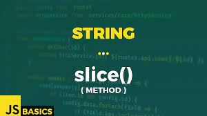
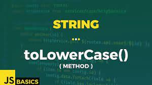
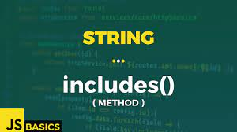
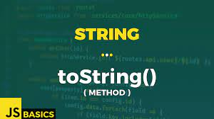
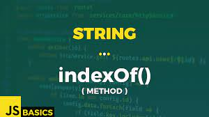

# What is a Method in javascript?
>A method is a block of code which only runs when it is called.
You can pass data, known as parameters, into a method.
Methods are used to perform certain actions, and they are
also known as functions.
# Create string in javascript

# JAVA SCRIPT STRING METHODS

# JavaScript String method charAt()
>The charAt() method returns the character at a specified index (position) in a string.
The index of the first character is 0, the second 1, ...
The index of the last character is string length - 1 .
.jpg)
# JavaScript String method at()
>Theat()method takes an integer value and returns a newString.
This method allows for positive and negative integers. Negative integers count
back from the last string character.
.jpg)
# JavaScript String method concat()
>Theconcat()method joins two or more strings.
Theconcat()method returns a new string.
.jpg)
# JavaScript String method replace()
>The replace()method returns a new string with the value(s) replaced.
The replace()method does not change the original string.
The replace() method searches a string for a value or a regular expression.
.jpg)
# JavaScript String method replaceAll()
>ThereplaceAll()method returns a new string with all matches of apatternreplaced by
areplacement.
.jpg)
# JavaScript String method split()
>The split() method splits a string into an array of substrings. The split() method returns the new
array. The split() method does not change the original string. If (" ") is used as separator, the string is
split between words.
.jpg)
# JavaScript String method substring(start,end)
>Thesubstring()method extracts characters, between two indices (positions), from a string, and
returns the substring.
Thesubstring()method extracts characters from start to end (exclusive).
Thesubstring()method does not change the original string.
If start is greater than end, arguments are swapped: (4, 1) = (1, 4).
Start or end values less than 0, are treated as 0.
.jpg)
# JavaScript String method slice(start, end)
> The method returns a shallow copy of a portion of an array into a new array object
selected from start to end
in that array.

# JavaScript String method toLowerCase()
> ThetoLowerCase()method converts a string to lowercase letters.
ThetoLowerCase()method does not change the original string.

# JavaScript String method toUpperCase()
>ThetoUpperCase()method converts a string to uppercase letters, using current locale.
ThetoUpperCase()method does not change the original string.
.jpg)
# JavaScript String method trim()
>Method removes whitespace from both sides of a string.
 the method does not change the original string.
 .jpg)
 # JavaScript String method includes()
 >Theincludes()method returnstrueif a string contains a specified string.
Otherwise it returnsfalse.
Theincludes()method is case sensitive.

# JavaScript String method toString()
> ThetoString()method returns a string representing the object.
By defaulttoString()takes no parameters.

# JavaScript String method indexOf()
>The method returns the position of the first occurrence of a value in a string.
The method returns -1 if the value is not found.
The method is case sensitive.

# JavaScript String method repeat()
>Therepeat()method creates a new string by repeating the given string a specified number of
times and returns it.
.jpg)
#
#
# NUMBER
## JavaScript Number methods Math.round(),ceil(),floor()
>The round() function rounds down a number to the next smallest integer.
The floor() function returns the number rounded to the nearest integer.
The ceil()method rounds a decimal number up to the next largest integer and returns it.
,ceil(),floor().avif)
# JavaScript Number methods Math.pow() and Math.sqrt()
>The method computes the square root of a specified number and returns it
 The method computes the power of a number by raising the second argument
sqrt()
pow()
to the power of the first argument.
%20and%20Math.sqrt().jpg)
# JavaScript String method Math.abs() and Math.random()
>The abs()method finds the absolute value of the specified number (without any sign) and returns it.
The and1(exclusive).
Math.random() function returns a floating-point, pseudo-random number between0(inclusive)

# JavaScript Number method isNaN()
> The isNaN() function checks if a value isNaN (Not-a-Number)or not.
.png)

# THANK YOU FOR WATCHING !!!
